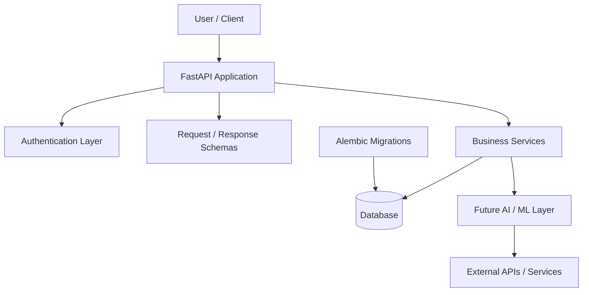
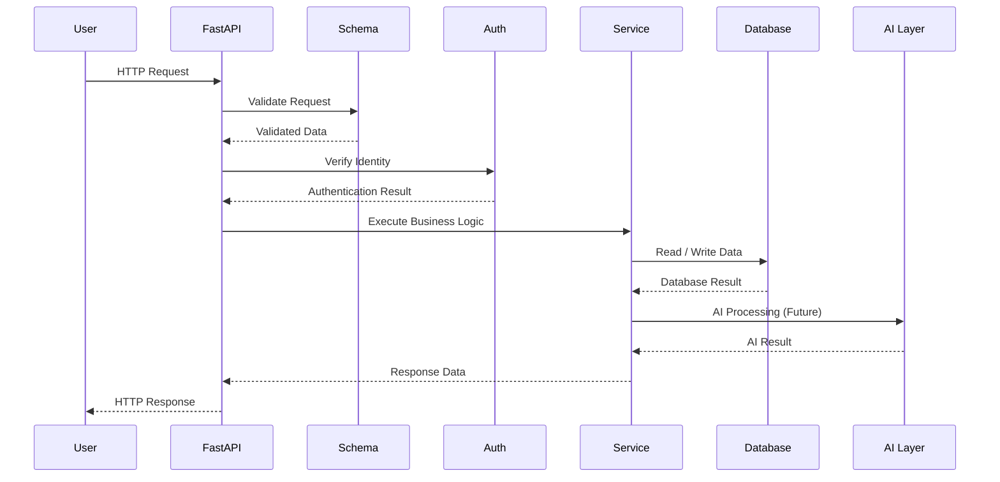

# MurphAI

<div align="center">

# 🧠 MurphAI

### Engineering-Focused AI Platform

**Backend Engineering • Artificial Intelligence • Automation • Cloud Infrastructure • DevOps • Observability • Security**

<br>

[](https://www.python.org/)
[](https://fastapi.tiangolo.com/)
[](https://www.postgresql.org/)
[](https://www.docker.com/)
[](https://pytest.org/)
[](https://alembic.sqlalchemy.org/)
[](https://git-scm.com/)
[](LICENSE)

</div>

---

## Table of Contents

- [What Is MurphAI](#what-is-murphai)
- [Why MurphAI](#why-murphai)
- [What Does MurphAI Actually Do](#what-does-murphai-actually-do)
- [Current Project Status](#current-project-status)
- [Vision](#vision)
- [Core Capabilities](#core-capabilities)
- [System Architecture](#system-architecture)
- [Application Request Flow](#application-request-flow)
- [Project Architecture](#project-architecture)
- [Repository Structure](#repository-structure)
- [Technology Stack](#technology-stack)
- [Backend Architecture](#backend-architecture)
- [Authentication](#authentication)
- [Database](#database)
- [Database Migration System](#database-migration-system)
- [API](#api)
- [Testing](#testing)
- [Environment Configuration](#environment-configuration)
- [Local Development](#local-development)
- [Running the Project](#running-the-project)
- [Docker](#docker)
- [Development Workflow](#development-workflow)
- [Security](#security)
- [Engineering Principles](#engineering-principles)
- [Roadmap](#roadmap)
- [Future AI and ML Layer](#future-ai-and-ml-layer)
- [Observability and Operations](#observability-and-operations)
- [Cloud and DevOps Direction](#cloud-and-devops-direction)
- [Project Goals](#project-goals)
- [Why This Project Matters](#why-this-project-matters)
- [Contributing](#contributing)
- [License](#license)
- [Author](#author)

---

## What Is MurphAI

MurphAI is an **engineering-focused AI platform** being developed to evolve from a reliable backend foundation into a practical system capable of understanding requests, working with information, interacting with external services, reasoning over data, and assisting with real-world workflows.

The project is intentionally designed as more than a basic chatbot.

The long-term goal is to combine:

- Backend engineering
- Artificial intelligence
- Machine learning
- Databases
- APIs
- Automation
- Cloud infrastructure
- DevOps
- Observability
- Security

into one extensible platform.

### The Core Idea

MurphAI aims to provide a foundation where AI capabilities can be added on top of a properly engineered software system.

Instead of starting with only an AI model and building everything around it, MurphAI starts with engineering fundamentals:

```text
Reliable Backend
       ↓
API Layer
       ↓
Authentication
       ↓
Database
       ↓
Business Logic
       ↓
Testing
       ↓
Containerization
       ↓
Cloud Infrastructure
       ↓
AI / ML Layer
       ↓
Automation
       ↓
Observability
       ↓
Intelligent Workflows
```

This approach makes MurphAI a long-term engineering project rather than a single-feature application.

---

## Why MurphAI

Many AI applications start and end with:

```text
User
  ↓
Prompt
  ↓
LLM
  ↓
Response
```

MurphAI is designed to go beyond this model.

A practical AI system needs more than text generation.

It needs:

- Identity
- Authentication
- Persistent data
- APIs
- Business logic
- External integrations
- Error handling
- Security
- Testing
- Infrastructure
- Deployment
- Monitoring
- Automation
- Reliable workflows

MurphAI is being built with these engineering requirements in mind.

### Engineering Philosophy

```text
AI is the intelligence layer.

Engineering is the foundation.

MurphAI combines both.
```

---

## What Does MurphAI Actually Do

### Current Stage

The current version of MurphAI focuses primarily on building the **backend engineering foundation** required for future intelligent capabilities.

The current backend provides the structure for:

- API development
- User management
- Authentication architecture
- Database integration
- Data models
- Request validation
- Business services
- Exception handling
- Database migrations
- Automated tests
- Environment-based configuration
- Containerized development

The project is intentionally being developed incrementally.

### Long-Term Behavior

The intended MurphAI workflow looks like:

```text
User Request
     │
     ▼
API Gateway
     │
     ▼
Authentication
     │
     ▼
Request Validation
     │
     ▼
Intent Understanding
     │
     ▼
Context / Memory
     │
     ▼
Information Retrieval
     │
     ▼
Reasoning
     │
     ├──────────────┐
     ▼              ▼
External APIs    Database
     │              │
     └──────┬───────┘
            ▼
      Decision / Action
            │
            ▼
        AI Response
            │
            ▼
      User / Workflow
```

The ultimate objective is for MurphAI to become capable of helping users complete meaningful tasks rather than simply generating text.

---

## Current Project Status

MurphAI is currently in the **backend foundation and system architecture stage**.

### Implemented Foundation

- [x] Project structure
- [x] Python virtual environment
- [x] Dependency management
- [x] FastAPI application
- [x] Uvicorn development server
- [x] API routing structure
- [x] Configuration layer
- [x] Environment variable support
- [x] Database layer
- [x] SQLAlchemy-based data access architecture
- [x] Alembic migration setup
- [x] User model
- [x] Authentication service structure
- [x] User service structure
- [x] Request/response schemas
- [x] Exception handling structure
- [x] Security module structure
- [x] Pytest configuration
- [x] Backend tests
- [x] Docker Compose configuration
- [x] Git repository
- [x] GitHub repository

### In Development

- [ ] Complete production-grade authentication
- [ ] Expand API functionality
- [ ] Improve database architecture
- [ ] AI integration
- [ ] Context and memory
- [ ] External service integrations
- [ ] AI-powered workflows

### Planned

- [ ] Retrieval-Augmented Generation
- [ ] Agentic workflows
- [ ] Automation engine
- [ ] Cloud deployment
- [ ] CI/CD
- [ ] Monitoring
- [ ] Observability
- [ ] Scalable infrastructure
- [ ] Production security hardening

> MurphAI is intentionally being developed step-by-step.  
> Features marked as planned are part of the roadmap and should not be considered production functionality yet.

---

## Vision

The long-term vision of MurphAI is to build a **practical digital intelligence platform** rather than another simple text-generation application.

MurphAI is intended to evolve toward a system that can:

- Understand natural-language requests
- Maintain useful context
- Analyze structured information
- Analyze unstructured information
- Retrieve relevant information
- Interact with APIs
- Interact with external services
- Reason over available data
- Automate repetitive workflows
- Assist users with completing tasks
- Provide actionable recommendations
- Execute controlled workflows
- Learn from system feedback

### Long-Term Vision

```text
                    ┌──────────────────────┐
                    │        User          │
                    └──────────┬───────────┘
                               │
                               ▼
                    ┌──────────────────────┐
                    │      MurphAI         │
                    │   Intelligence Core  │
                    └──────────┬───────────┘
                               │
          ┌────────────────────┼────────────────────┐
          │                    │                    │
          ▼                    ▼                    ▼
     Information          External APIs        Automation
      Retrieval             & Services           Engine
          │                    │                    │
          └────────────────────┼────────────────────┘
                               │
                               ▼
                    ┌──────────────────────┐
                    │    Reasoning Layer   │
                    └──────────┬───────────┘
                               │
                               ▼
                    ┌──────────────────────┐
                    │   Action / Response  │
                    └──────────────────────┘
```

---

## Core Capabilities

MurphAI is being designed around several major capability areas.

### 1. Natural Language Understanding

The AI layer will eventually interpret user requests and determine:

- What the user wants
- What information is required
- What actions are needed
- Which tools should be used
- What context is relevant

---

### 2. Context and Memory

Future versions will support useful context management.

Potential capabilities include:

- Conversation context
- User preferences
- Task context
- Long-term memory
- Relevant historical information

---

### 3. Information Retrieval

MurphAI is designed to eventually retrieve information from:

- Databases
- Documents
- APIs
- External services
- Structured datasets
- Unstructured data

---

### 4. Reasoning

The system will eventually combine:

```text
User Intent
     +
Context
     +
Retrieved Information
     +
Available Tools
     ↓
Reasoning
     ↓
Action / Answer
```

---

### 5. External Service Integration

MurphAI can evolve toward interacting with external systems through APIs.

Examples:

- Cloud services
- Internal APIs
- Data services
- Automation systems
- Monitoring systems
- Third-party applications

---

### 6. Workflow Automation

A future automation layer can help execute repetitive workflows.

For example:

```text
Trigger
   ↓
Understand Request
   ↓
Validate
   ↓
Retrieve Data
   ↓
Perform Action
   ↓
Verify Result
   ↓
Report Result
```

---

### 7. Engineering Reliability

The platform is being built around software engineering practices such as:

- Modular architecture
- Automated testing
- Environment configuration
- Database migrations
- Error handling
- Security boundaries
- Containerization
- Version control

---

## System Architecture

The current system is structured as a modular backend that can later accommodate AI and infrastructure components.



### Architectural Layers

```text
┌─────────────────────────────────────┐
│             Client Layer            │
├─────────────────────────────────────┤
│              API Layer              │
├─────────────────────────────────────┤
│        Authentication Layer         │
├─────────────────────────────────────┤
│          Schema / Validation        │
├─────────────────────────────────────┤
│          Service / Logic            │
├─────────────────────────────────────┤
│          Data Access Layer          │
├─────────────────────────────────────┤
│             Database                │
└─────────────────────────────────────┘
```

Future AI components will be integrated without destroying the existing backend architecture.

---

## Application Request Flow

A typical request is intended to follow a controlled path through the application.



This separation helps keep the system maintainable as complexity increases.

---

## Project Architecture

MurphAI follows a modular backend structure.

```text
MurphAI/
│
├── backend/
│   ├── app/
│   │   ├── api/
│   │   │   ├── __init__.py
│   │   │   ├── auth.py
│   │   │   └── users.py
│   │   │
│   │   ├── core/
│   │   │   ├── __init__.py
│   │   │   ├── config.py
│   │   │   ├── exception_handlers.py
│   │   │   ├── exceptions.py
│   │   │   └── security.py
│   │   │
│   │   ├── database/
│   │   │   ├── __init__.py
│   │   │   └── database.py
│   │   │
│   │   ├── models/
│   │   │   ├── __init__.py
│   │   │   └── user.py
│   │   │
│   │   ├── schemas/
│   │   │   ├── __init__.py
│   │   │   ├── auth.py
│   │   │   └── user.py
│   │   │
│   │   ├── services/
│   │   │   ├── __init__.py
│   │   │   ├── auth_service.py
│   │   │   └── user_service.py
│   │   │
│   │   └── main.py
│   │
│   └── tests/
│       ├── conftest.py
│       └── test_users.py
│
├── alembic/
│   ├── versions/
│   ├── env.py
│   ├── script.py.mako
│   └── README
│
├── docs/
│
├── infrastructure/
│
├── ml/
│
├── .env
├── .env.example
├── .gitignore
├── alembic.ini
├── docker-compose.yml
├── pytest.ini
├── requirements.txt
├── README.md
└── murphai.db
```

---

## Repository Structure

### `backend/`

Contains the primary backend application.

The backend is responsible for:

- HTTP APIs
- Authentication
- Business logic
- Database interaction
- Validation
- Error handling
- User management

---

### `backend/app/api/`

Contains API route modules.

Examples:

```text
auth.py
users.py
```

These modules define application endpoints and connect incoming requests with the appropriate services.

---

### `backend/app/core/`

Contains application-wide infrastructure.

Examples:

```text
config.py
security.py
exceptions.py
exception_handlers.py
```

This layer centralizes configuration, security-related functionality, and error handling.

---

### `backend/app/database/`

Responsible for database connectivity and database-related configuration.

---

### `backend/app/models/`

Contains database models.

For example:

```text
user.py
```

Models represent persistent application data.

---

### `backend/app/schemas/`

Contains request and response schemas.

Schemas provide validation and define the expected structure of API data.

---

### `backend/app/services/`

Contains business logic.

Examples:

```text
auth_service.py
user_service.py
```

Keeping business logic inside services helps prevent API route files from becoming too large.

---

### `backend/tests/`

Contains automated tests for backend functionality.

---

### `alembic/`

Contains database migration configuration and migration history.

---

### `docs/`

Reserved for project documentation, technical decisions, architecture documents, and future design specifications.

---

### `infrastructure/`

Reserved for infrastructure-as-code and cloud infrastructure components.

Future technologies may include:

- Terraform
- AWS infrastructure
- Kubernetes manifests
- Deployment configuration

---

### `ml/`

Reserved for future machine learning and AI components.

Potential future contents include:

- Model integrations
- RAG
- Embeddings
- Vector search
- Evaluation
- AI workflows

---

## Technology Stack

| Layer | Technology |
|---|---|
| Programming Language | Python |
| Backend Framework | FastAPI |
| ASGI Server | Uvicorn |
| Data Validation | Pydantic |
| ORM / Database Layer | SQLAlchemy |
| Database Migration | Alembic |
| Testing | Pytest |
| Containerization | Docker |
| Local Orchestration | Docker Compose |
| Version Control | Git |
| Repository | GitHub |
| AI / ML | Planned |
| Cloud Infrastructure | Planned |
| CI/CD | Planned |
| Observability | Planned |

The exact dependency versions are maintained in:

```text
requirements.txt
```

---

## Backend Architecture

The backend follows a layered architecture.

```text
                    HTTP Request
                         │
                         ▼
              ┌─────────────────────┐
              │      API Routes     │
              └──────────┬──────────┘
                         │
                         ▼
              ┌─────────────────────┐
              │ Schema / Validation │
              └──────────┬──────────┘
                         │
                         ▼
              ┌─────────────────────┐
              │ Authentication      │
              └──────────┬──────────┘
                         │
                         ▼
              ┌─────────────────────┐
              │ Business Services   │
              └──────────┬──────────┘
                         │
                         ▼
              ┌─────────────────────┐
              │ Database Layer      │
              └──────────┬──────────┘
                         │
                         ▼
                    Database
```

### Why This Architecture

A layered architecture provides:

- Separation of concerns
- Easier testing
- Easier debugging
- Better maintainability
- Easier scaling
- Cleaner business logic
- Easier future AI integration

---

## Authentication

MurphAI includes an authentication architecture designed to separate identity management from business logic.

The authentication system is structured around:

```text
Authentication API
        ↓
Authentication Service
        ↓
Security Layer
        ↓
User Model
        ↓
Database
```

The architecture can later be extended with:

- Password hashing
- Access tokens
- Refresh tokens
- Role-based access control
- Permission management
- Session management
- OAuth integrations

Production authentication features should be considered complete only after their implementation and security testing are finalized.

---

## Database

The application uses a database layer to provide persistent storage.

The current repository contains a database architecture designed around:

```text
Application
     │
     ▼
SQLAlchemy
     │
     ▼
Database Connection
     │
     ▼
Database
```

### User Data

The current backend includes a user model and supporting schemas/services.

This provides the foundation for future features such as:

- User profiles
- Authentication
- Preferences
- Conversation history
- AI memory
- Permissions
- Task history

---

## Database Migration System

MurphAI uses **Alembic** for database migrations.

Instead of manually changing database tables, schema changes can be represented as migration files.

### Migration Flow

```text
Python Model Change
        ↓
Generate Migration
        ↓
Review Migration
        ↓
Apply Migration
        ↓
Database Schema Updated
```

### Useful Commands

Create a migration:

```bash
alembic revision --autogenerate -m "describe change"
```

Apply migrations:

```bash
alembic upgrade head
```

Rollback the latest migration:

```bash
alembic downgrade -1
```

Check migration history:

```bash
alembic history
```

Check current migration:

```bash
alembic current
```

Always review autogenerated migrations before applying them.

---

## API

MurphAI exposes its backend through HTTP APIs.

The API layer is implemented using FastAPI.

### API Design

The general structure is:

```text
/api
   │
   ├── auth
   │
   └── users
```

The exact available endpoints should be treated as the source of truth in the implementation.

### FastAPI Documentation

When the application is running, FastAPI provides interactive API documentation through its documentation endpoints.

Typical development URLs are:

```text
http://127.0.0.1:8000/docs
```

and:

```text
http://127.0.0.1:8000/redoc
```

---

## API Design Principles

MurphAI aims to follow:

- RESTful API principles
- Clear request schemas
- Clear response schemas
- Proper HTTP status codes
- Validation
- Authentication boundaries
- Centralized error handling
- Separation of routes and business logic

Example conceptual API flow:

```text
POST /api/auth/...
        │
        ▼
Authentication Service
        │
        ▼
Database
        │
        ▼
Response
```

---

## Testing

Testing is an important part of the MurphAI engineering foundation.

The project uses:

```text
Pytest
```

Tests are organized under:

```text
backend/tests/
```

### Test Architecture

```text
Test
 ↓
API
 ↓
Service
 ↓
Database
 ↓
Result
```

### Run Tests

From the project root:

```bash
pytest
```

For more detailed output:

```bash
pytest -v
```

### Testing Goals

The test suite is intended to eventually cover:

- API behavior
- User operations
- Authentication
- Validation
- Database operations
- Error handling
- Security-sensitive behavior
- AI workflows
- Integration workflows

---

## Environment Configuration

MurphAI uses environment variables for configuration.

A template is provided through:

```text
.env.example
```

Example structure:

```env
DATABASE_URL=
SECRET_KEY=
```

### Local Environment

Create your local environment file:

```bash
cp .env.example .env
```

Then configure the required values.

### Important Security Rule

Never commit secrets into Git.

The following should remain local or be provided through secure deployment configuration:

```text
.env
API keys
Database passwords
Secret keys
Access tokens
Cloud credentials
Private credentials
```

The `.env.example` file should contain placeholders rather than real secrets.

---

## Local Development

### 1. Clone the Repository

```bash
git clone https://github.com/manish9608mk/MurphAI.git
```

Move into the project:

```bash
cd MurphAI
```

---

### 2. Create Virtual Environment

```bash
python3 -m venv .venv
```

Activate it:

```bash
source .venv/bin/activate
```

---

### 3. Install Dependencies

```bash
pip install -r requirements.txt
```

---

### 4. Configure Environment

Create the environment file:

```bash
cp .env.example .env
```

Add the required configuration values.

---

### 5. Run Database Migrations

```bash
alembic upgrade head
```

---

## Running the Project

Start the FastAPI application with Uvicorn.

Depending on the project configuration, the application can be started with:

```bash
uvicorn backend.app.main:app --reload
```

The development server will normally be available at:

```text
http://127.0.0.1:8000
```

### API Documentation

Open:

```text
http://127.0.0.1:8000/docs
```

### ReDoc

Open:

```text
http://127.0.0.1:8000/redoc
```

### Development Loop

```text
Write Code
    ↓
Run Application
    ↓
Test API
    ↓
Run Pytest
    ↓
Fix Issues
    ↓
Commit
    ↓
Push
```

---

## Docker

Docker is included in the project to support reproducible development and future deployment workflows.

The project includes:

```text
docker-compose.yml
```

### Docker Architecture

```text
┌─────────────────────────┐
│      Docker Compose     │
├─────────────────────────┤
│                         │
│   ┌─────────────────┐   │
│   │   MurphAI API   │   │
│   └─────────────────┘   │
│                         │
│   ┌─────────────────┐   │
│   │    Database     │   │
│   └─────────────────┘   │
│                         │
└─────────────────────────┘
```

### Start Containers

```bash
docker compose up --build
```

Run in detached mode:

```bash
docker compose up -d --build
```

Stop containers:

```bash
docker compose down
```

View running containers:

```bash
docker compose ps
```

View logs:

```bash
docker compose logs
```

For production deployment, container configuration should be reviewed and hardened separately.

---

## Development Workflow

MurphAI follows a software-engineering-oriented development workflow.

```text
                ┌───────────────┐
                │   Idea / Task │
                └───────┬───────┘
                        ↓
                ┌───────────────┐
                │ Design Change │
                └───────┬───────┘
                        ↓
                ┌───────────────┐
                │ Implement     │
                └───────┬───────┘
                        ↓
                ┌───────────────┐
                │ Test          │
                └───────┬───────┘
                        ↓
                ┌───────────────┐
                │ Review        │
                └───────┬───────┘
                        ↓
                ┌───────────────┐
                │ Git Commit    │
                └───────┬───────┘
                        ↓
                ┌───────────────┐
                │ GitHub Push   │
                └───────┬───────┘
                        ↓
                ┌───────────────┐
                │ Future CI/CD  │
                └───────────────┘
```

### Git Workflow

Example:

```bash
git status
```

Stage changes:

```bash
git add .
```

Commit:

```bash
git commit -m "Describe the change"
```

Push:

```bash
git push
```

---

## Security

Security is considered a first-class engineering concern.

### Current Security Principles

- Secrets are stored through environment variables
- `.env` should not be committed
- Configuration is separated from source code
- Authentication has its own service/security layer
- Exception handling is centralized
- Input validation is handled through schemas

### Future Security Work

Planned improvements include:

- Strong password hashing
- Token security
- Role-based authorization
- Rate limiting
- API security
- Input sanitization
- Secure headers
- Audit logging
- Dependency security scanning
- Secret management
- Cloud IAM
- Infrastructure security

---

## Engineering Principles

MurphAI follows several engineering principles.

### Separation of Concerns

Each component should have one clear responsibility.

```text
API
 ↓
Validation
 ↓
Service
 ↓
Database
```

---

### Modular Design

Features should be developed as independent modules whenever practical.

---

### Testability

Business logic should be structured so that it can be tested independently.

---

### Configuration Through Environment

Environment-specific configuration should not be hardcoded.

---

### Explicit Error Handling

Errors should be handled intentionally rather than silently ignored.

---

### Incremental Development

MurphAI is being built in stages rather than attempting to implement every feature simultaneously.

---

### Production Mindset

Even during development, the project is designed with future requirements such as:

- Scalability
- Security
- Observability
- Deployment
- Maintainability

in mind.

---

## Roadmap

MurphAI is planned to evolve through multiple engineering stages.

### Phase 1 — Backend Foundation

- [x] Project structure
- [x] FastAPI
- [x] Database architecture
- [x] User model
- [x] Services
- [x] Schemas
- [x] Authentication architecture
- [x] Exception handling
- [x] Testing foundation

---

### Phase 2 — Production Backend

- [ ] Complete authentication
- [ ] Authorization
- [ ] User management
- [ ] API versioning
- [ ] Improved database architecture
- [ ] Better error responses
- [ ] API documentation
- [ ] Integration tests

---

### Phase 3 — AI Integration

- [ ] LLM integration
- [ ] Prompt architecture
- [ ] Conversation management
- [ ] Context handling
- [ ] AI service abstraction
- [ ] Model evaluation

---

### Phase 4 — Memory and Retrieval

- [ ] Conversation memory
- [ ] Embeddings
- [ ] Vector search
- [ ] RAG
- [ ] Document ingestion
- [ ] Knowledge retrieval

---

### Phase 5 — Intelligent Workflows

- [ ] Tool calling
- [ ] External APIs
- [ ] Task execution
- [ ] Workflow engine
- [ ] Automation
- [ ] Controlled actions

---

### Phase 6 — Cloud Infrastructure

- [ ] AWS infrastructure
- [ ] Infrastructure as Code
- [ ] Terraform
- [ ] Container deployment
- [ ] Kubernetes
- [ ] Load balancing
- [ ] Scalable services

---

### Phase 7 — DevOps

- [ ] CI/CD
- [ ] GitHub Actions
- [ ] Automated testing
- [ ] Container builds
- [ ] Automated deployment
- [ ] Environment promotion

---

### Phase 8 — Observability

- [ ] Metrics
- [ ] Logs
- [ ] Tracing
- [ ] Prometheus
- [ ] Grafana
- [ ] Alerting
- [ ] Application health monitoring

---

### Phase 9 — Production AI Platform

```text
Reliable Backend
       +
AI / ML
       +
Memory
       +
Tools
       +
Automation
       +
Cloud
       +
Observability
       +
Security
       ↓
Production-Grade AI Platform
```

---

## Future AI and ML Layer

The `ml/` directory provides a dedicated place for future AI/ML functionality.

The AI layer is expected to remain separate from the core backend so that models and intelligence-related components can evolve independently.

### Potential AI Architecture

```text
                    User Request
                         │
                         ▼
                  Intent Detection
                         │
                         ▼
                   Context Manager
                         │
              ┌──────────┴──────────┐
              ▼                     ▼
        Knowledge Retrieval      Tool Selection
              │                     │
              └──────────┬──────────┘
                         ▼
                     LLM / Model
                         │
                         ▼
                    Reasoning
                         │
                         ▼
                   Action / Answer
```

### Potential ML Components

Future versions may include:

- LLM APIs
- Embeddings
- Vector databases
- Retrieval-Augmented Generation
- Prompt management
- Model evaluation
- Classification
- Recommendation systems
- Agent workflows
- AI observability

---

## Observability and Operations

A production AI system needs visibility into its behavior.

MurphAI is planned to include observability across:

```text
Application
    │
    ├── Logs
    │
    ├── Metrics
    │
    ├── Traces
    │
    ├── Errors
    │
    └── AI Performance
```

### Future Metrics

Potential metrics include:

- Request count
- Request latency
- Error rate
- Database latency
- AI response latency
- Token usage
- Model failures
- Workflow failures
- Resource utilization

### Monitoring Stack

Planned technologies include:

```text
Prometheus
     ↓
Metrics
     ↓
Grafana
     ↓
Dashboards
     ↓
Alerts
```

---

## Cloud and DevOps Direction

MurphAI is designed with a future cloud-native architecture in mind.

### Planned Infrastructure

```text
Developer
    │
    ▼
GitHub
    │
    ▼
CI/CD
    │
    ▼
Container Build
    │
    ▼
Container Registry
    │
    ▼
Cloud Infrastructure
    │
    ▼
Application
    │
    ├── API
    ├── Database
    ├── AI Services
    ├── Monitoring
    └── Logging
```

### Planned Technologies

Potential infrastructure technologies include:

- AWS
- Docker
- Kubernetes
- Terraform
- GitHub Actions
- Prometheus
- Grafana

---

## Project Goals

MurphAI is being developed with several goals.

### Engineering Goal

Build a backend that follows professional software engineering practices.

### AI Goal

Create an intelligent system capable of understanding requests and assisting with useful workflows.

### Infrastructure Goal

Develop the ability to run the platform reliably on cloud infrastructure.

### DevOps Goal

Automate testing, building, deployment, monitoring, and operational workflows.

### Security Goal

Build security into the architecture rather than adding it only at the end.

### Learning Goal

Use MurphAI as a continuously evolving engineering project covering:

```text
Python
  ↓
Backend
  ↓
Databases
  ↓
APIs
  ↓
AI / ML
  ↓
Docker
  ↓
Cloud
  ↓
Kubernetes
  ↓
Terraform
  ↓
CI/CD
  ↓
Observability
  ↓
Production Engineering
```

---

## Why This Project Matters

MurphAI is not intended to be only a demonstration application.

The project is designed to demonstrate the ability to work across multiple engineering layers.

### Backend Engineering

```text
FastAPI
SQLAlchemy
Alembic
Pydantic
Pytest
```

### AI Engineering

```text
LLMs
RAG
Embeddings
Agents
AI Workflows
```

### Cloud Engineering

```text
AWS
Docker
Kubernetes
Terraform
```

### DevOps

```text
Git
GitHub
CI/CD
Automation
Monitoring
```

### Production Engineering

```text
Security
Observability
Scalability
Reliability
Maintainability
```

The long-term goal is to bring these disciplines together inside one coherent system.

---

## Project Maturity Model

MurphAI can be viewed as evolving through the following stages:

```text
Stage 1
Backend Foundation
       │
       ▼
Stage 2
Production Backend
       │
       ▼
Stage 3
AI Integration
       │
       ▼
Stage 4
Memory + Retrieval
       │
       ▼
Stage 5
Tools + Automation
       │
       ▼
Stage 6
Cloud Deployment
       │
       ▼
Stage 7
Observability
       │
       ▼
Stage 8
Production AI Platform
```

---

## Contributing

MurphAI is currently being developed as an evolving engineering project.

Future contributions may include:

- Bug fixes
- API improvements
- Tests
- Documentation
- Infrastructure
- AI integrations
- Security improvements
- Performance improvements

### Contribution Workflow

```text
Fork
 ↓
Create Branch
 ↓
Implement Change
 ↓
Write Tests
 ↓
Run Test Suite
 ↓
Commit
 ↓
Push
 ↓
Pull Request
```

---

## License

This project is licensed under the MIT License.

See the `LICENSE` file for details.

---

## Author

<div align="center">

### Manish Kumar

**Engineer • Backend • Cloud • DevOps • AI**

Building MurphAI as a long-term engineering project.

<br>

**MurphAI**

> Engineering the foundation for practical digital intelligence.

</div>

---

## Final Architecture

The long-term MurphAI architecture can be summarized as:

```text
                              ┌───────────────┐
                              │     USER      │
                              └───────┬───────┘
                                      │
                                      ▼
                           ┌────────────────────┐
                           │     API GATEWAY    │
                           └─────────┬──────────┘
                                     │
                                     ▼
                           ┌────────────────────┐
                           │  AUTHENTICATION    │
                           └─────────┬──────────┘
                                     │
                                     ▼
                           ┌────────────────────┐
                           │ REQUEST VALIDATION │
                           └─────────┬──────────┘
                                     │
                                     ▼
                           ┌────────────────────┐
                           │  BUSINESS LOGIC    │
                           └─────────┬──────────┘
                                     │
                 ┌───────────────────┼───────────────────┐
                 │                   │                   │
                 ▼                   ▼                   ▼
          ┌────────────┐      ┌────────────┐      ┌────────────┐
          │  DATABASE  │      │ AI / LLM   │      │ EXTERNAL   │
          │            │      │   LAYER    │      │ SERVICES   │
          └────────────┘      └──────┬─────┘      └─────┬──────┘
                                     │                  │
                                     └────────┬─────────┘
                                              │
                                              ▼
                                    ┌──────────────────┐
                                    │     REASONING    │
                                    └────────┬─────────┘
                                             │
                                             ▼
                                    ┌──────────────────┐
                                    │    WORKFLOW      │
                                    │    AUTOMATION    │
                                    └────────┬─────────┘
                                             │
                                             ▼
                                    ┌──────────────────┐
                                    │     RESPONSE     │
                                    └────────┬─────────┘
                                             │
                                             ▼
                                           USER


       ┌─────────────────────────────────────────────────────┐
       │                 PLATFORM FOUNDATION                  │
       │                                                     │
       │  Docker • Cloud • CI/CD • Monitoring • Security    │
       │  Terraform • Kubernetes • Prometheus • Grafana     │
       │                                                     │
       └─────────────────────────────────────────────────────┘
```

---

<div align="center">

# MurphAI

### From Backend Foundation → Intelligent Engineering Platform

**Build. Learn. Engineer. Automate.**

</div>